# Triển khai giải pháp SIEM ELK Stack

# ELK Stack là gì?

ELK Stack (ELK) là giải pháp SIEM của Elastic. Nó bao gồm 3 thành phần chính: Elasticsearch, Logstash và Kibana, thường được sử dụng cùng với nhau để thu thập, xử lý, lưu trữ, tìm kiếm và trực quan hóa dữ liệu một cách hiệu quả.

Các thành phần chính của ELK bao gồm:

* Các beat: Làm trung gian để dữ liệu được đẩu vào Logstash hoặc Elasticsearch từ các nguồn tương ứng. Một số beat phổ biến là Filebeat, Winlogbeat,...

* Logstash: Thu thập, xử lý và chuyển tiếp dữ liệu từ các beat.

* Elasticsearch: Tìm kiếm và phân tích dữ liệu đã được chuẩn hóa từ Logstash.

* Kibana: Hiển thị các phân tích từ Elasticsearch một cách trực quan.

Hình dưới đây trực quan các thành phần chính của ELK.

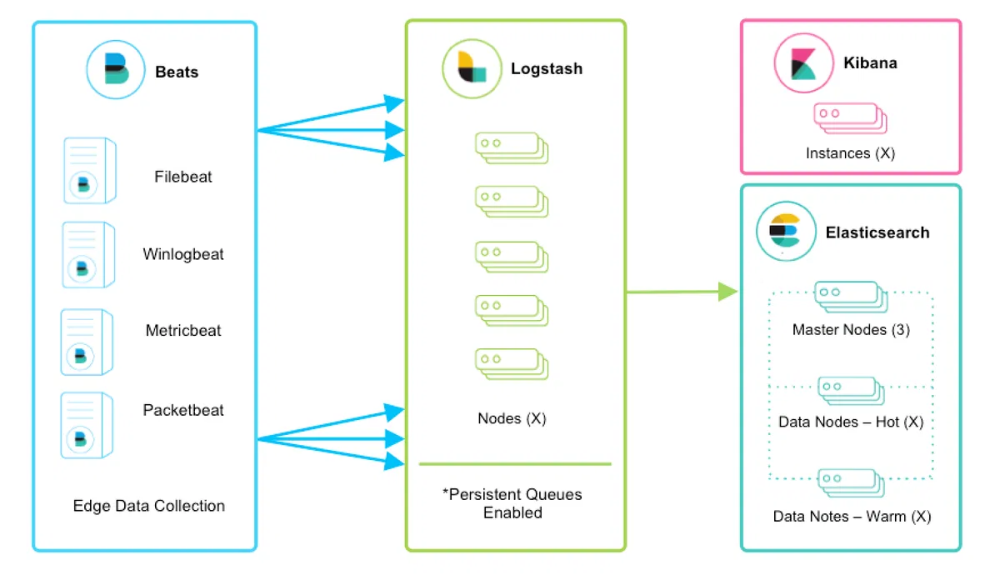

# Triển khai

## Kiến trúc hệ thống

Hình dưới đây mô tả kiến trúc hệ thống sẽ triển khai. Cụ thể, Linux log được xử lý như sau: Linux log -> Filebeat -> Logstash -> Elasticearch. Còn Windows log được xử lý như sau: Windows log -> Winlogbeat, Elasticsearch.

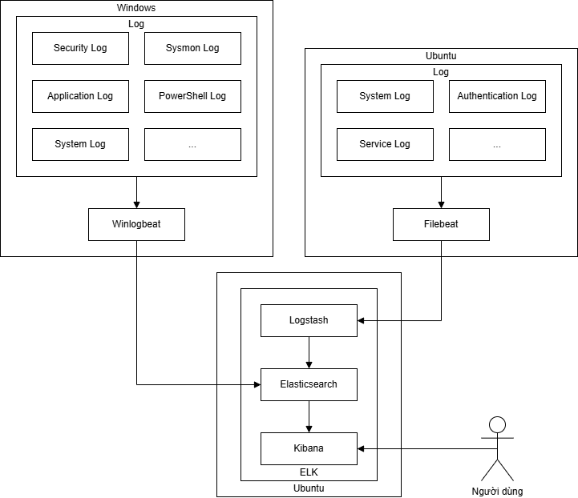

## Sơ đồ hệ thống

Các thành phần của ELK sẽ được triển khai trên các máy ảo được tạo bởi Oracle VirtualBox. Hình dưới đây mô tả các máy ảo sẽ được sử dụng. Máy ELK triển khai Logstash, Elasticsearch và Kibana. Máy Ubuntu sinh Linux log và triển khai Filebeat. Máy Windows sinh Windows log và triển khai Winlogbeat. Các máy đều có 2 card mạng ảo, 1 card mạng kết nối Internet và 1 card mạng kết nối với nhau qua dải địa chỉ 192.168.56.x.

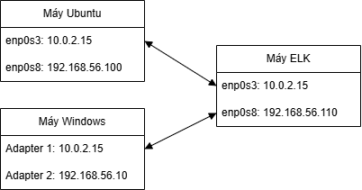

## Filebeat

Trước khi cài đặt các thành phần của hệ thống, trên máy ELK và máy Ubuntu cần chạy hai lệnh sau:

wget -qO - https://artifacts.elastic.co/GPG-KEY-elasticsearch | sudo apt-key add -

echo "deb https://artifacts.elastic.co/packages/7.x/apt stable main" | sudo tee -a /etc/apt/sources.list.d/elastic-7.x.list

Câu lệnh đầu tiên sẽ tải tệp có chứa khóa GPG (GNU Privacy Guard) - cặp khóa mật mã cho ký số và xác thực dữ liệu từ Elastic - với chế độ im lặng (quiet mode) nhưng ghi nội dung đã tải được ra màn hình, sau đó thêm khóa GPG này vào hệ thống APT (Advanced Package Tool) - hệ thống quản lý các gói phần mềm mặc định của Ubuntu. Sau khi thực thi câu lệnh đầu tiên, câu lệnh thứ hai sẽ thêm repository của Elastic vào hệ thống APT để tải về các thành phần của ELK bằng lệnh apt.

Tiếp theo, ta chạy câu lệnh tải Filebeat về máy Ubuntu:

sudo apt-get install filebeat

Toàn bộ các tệp cấu hình của Filebeat sau khi tải về sẽ nằm trong thư mục /etc/filebeat. Trong thư mục này, tệp cấu hình chính là filebeat.yml. Tệp này cấu hình các chức năng của Filebeat.

Phần đầu tiên cần được cấu hình trong tệp trên là đầu vào của Filebeat. Hình dưới đây thể hiện các mục trong phần cấu hình đầu vào. Cụ thể như sau:

* type: Định nghĩa loại dữ liệu đầu vào. Ở đây, dữ liệu đầu vào là các dòng log nên mặc định sẽ chọn "filestream".

* id: Gán định danh cho dữ liệu đầu vào trên. Mục này được để mặc định.

* paths: Định nghĩa các đường dẫn tới tệp log trên máy Ubuntu. Ở đây, các đường dẫn được định nghĩa là toàn bộ các tệp có đuôi .log trong thư mục /var/log, tệp syslog và toàn bộ các tệp audit log có đuôi .log trong thư mục /var/log/audit.

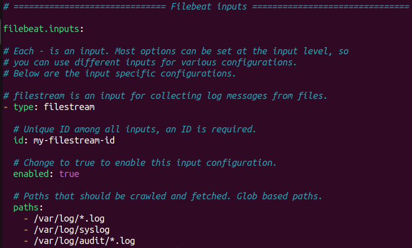

Phần tiếp theo cần được cấu hình là Kibana endpoint để Kibana trên máy ELK nhận được thông tin từ Filebeat, được thể hiện ở hình dưới đây. Phần này chỉ cấu hình host của Kibana theo dạng: <Địa chỉ IP của máy ELK>:5601. Ở đây, địa chỉ IP của máy ELK là 192.168.56.110.

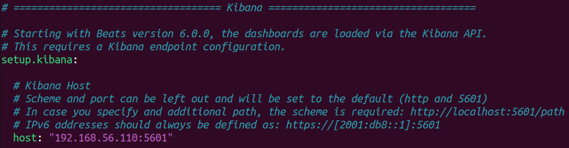

Phần cuối cùng cần được cấu hình là đầu ra của Filebeat. Do đầu ra là Logstash trên máy ELK, nên phần cấu hình là output.logstash như hình dưới đây. Phần này chỉ cấu hình host của Logstash theo dạng: <Địa chỉ IP của máy ELK>:5044. Ở đây, địa chỉ IP của máy ELK là 192.168.56.110.

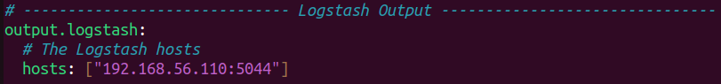

## Winlogbeat

Winlogbeat được tải về từ trang chủ của Elastic (https://www.elastic.co/downloads/past-releases/winlogbeat-7-17-29) và được về thư mục C:\Users\MayWindows\Desktop\winlogbeat. Tệp cấu hình các chức năng chính của Winlogbeat là winlogbeat.yml.

Giống như Filebeat, phần đầu tiên cần được cấu hình là phần đầu vào của Winlogbeat (phần winlogbeat.event_logs). Đó là dữ liệu log mà ELK muốn thu thập như Application, System, Security, Sysmon,. . . như hình dưới đây.

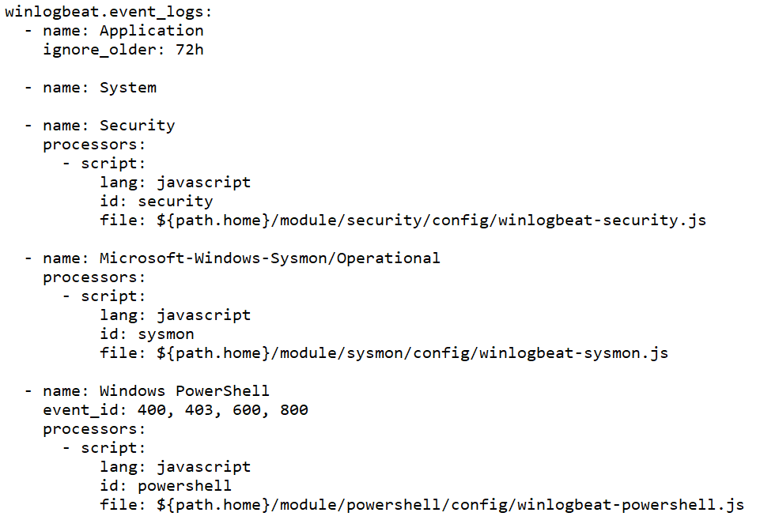

Tiếp theo, Winlogbeat cần được cấu hình Kibana endpoint như Filebeat như hình dưới đây. Tương tự như Filebeat, host của Kibana có dạng: <Địa chỉ IP của máy ELK>:5601. Ở đây, 192.168.56.110 là địa chỉ IP của máy ELK.

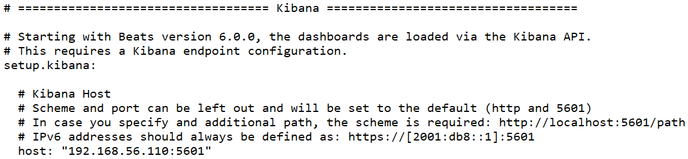

Cuối cùng, Winlogbeat cần được cấu hình đầu ra. Ở đây, dữ liệu log từ Winlogbeat sẽ được gửi trực tiếp đến Elasticsearch mà không cần qua Logstash để xử lý. Phần cấu hình này nằm ở mục output.elasticsearch như hình dưới đây. Các mục cần cấu hình là:

* hosts: Host của Elasticsearch. Nó có dạng <Địa chỉ IP của máy ELK>:5601. Ở đây, 192.168.56.110 là địa chỉ IP của máy ELK.

* username: Tên đăng nhập vào Elasticsearch.

* password: Mật khẩu đăng nhập vào Elasticsearch.

Tên đăng nhập và mật khẩu đăng nhập vào Elasticsearch sẽ được đề cập cụ thể ở phần sau.

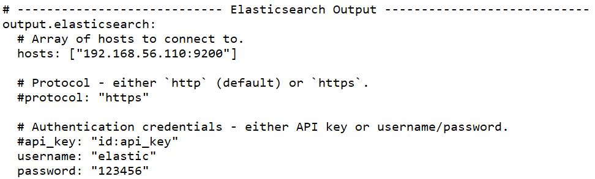

## Logstash

Câu lệnh cài đặt Logstash bằng APT là:

sudo apt-get install logstash

Các tệp cấu hình của Logstash nằm trong thư mục /etc/logstash. Trong thư mục này, hai tệp cấu hình chính của Logstash là logstash.yml (cấu hình hoạt động của Logstash) và pipelines.yml (cấu hình pipeline các tệp cấu hình xử lý dữ liệu log). Ở đây, hai tệp cấu hình trên được giữ nguyên.

Trong thư mục cấu hình của Logstash, có một thư mục quyết định cách thức xử lý dữ liệu log là /conf.d. Ban đầu, thư mục này không có bất kỳ tệp nào. Do vậy, cần tạo các tệp cấu hình cách thức xử lý dữ liệu log có đuôi .conf và lưu vào thư mục này. Repo Logstash-log-parsing-configuration-file (https://github.com/PhamVanNguyen110104/Logstash-log-parsing-configuration-file) chứa các tệp cấu hình trên. Thứ tự xử lý từ 00 đến số lớn nhất.

## Elasticsearch

Câu lệnh cài đặt Elasticsearch bằng hệ thống APT là:

sudo apt-get install elasticsearch

Các tệp cấu hình của Elasticsearch nằm trong thư mục /etc/elasticsearch. Trong thư mục này, tệp cấu hình các chức năng chính của Elasticsearch là elasticsearch.yml.

Phần cấu hình đầu tiên là mục Discovery, được thể hiện trong hình dưới đây. Ở đây, discovery là tiến trình mà các node trong một cluster sử dụng để tìm thấy nhau nhằm hình thành hoặc duy trì một cluster ổn định. Trong dự án này, do Elasticsearch chỉ chạy một node duy nhất nên tệp này có dòng cấu hình: discovery.type: singlenode. Ngoài ra, dòng cấu hình network.bind_host: ["127.0.0.1", "192.168.56.110"] chỉ ra các địa chỉ IP mà Elasticsearch lắng nghe. Cụ thể, người dùng chỉ có thể truy cập Elasticsearch từ chính máy đang cài đặt Elasticsearch (máy ELK) hoặc từ các máy tính khác trong cùng dải mạng nội bộ 192.168.56.x.

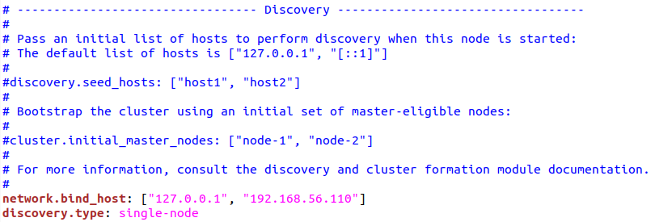

Phần cấu hình thứ hai là mục Security. Đây là chức năng quan trọng của Elasticsearch vì nó là nơi viết các rule phát hiện các hành vi bất thường và là nơi phát cảnh báo nếu thỏa mãn rule. Mặc định, chức năng này bị tắt. Do vậy, cấu hình Elasticsearch cần có 2 dòng như hình dưới đây. Cụ thể, dòng xpack.security.enabled: true kích hoạt chức năng Security. Còn dòng xpack.security.authc.api_key.enabled: true để bật API key, khóa xác thực truy cập vào Elasticsearch.

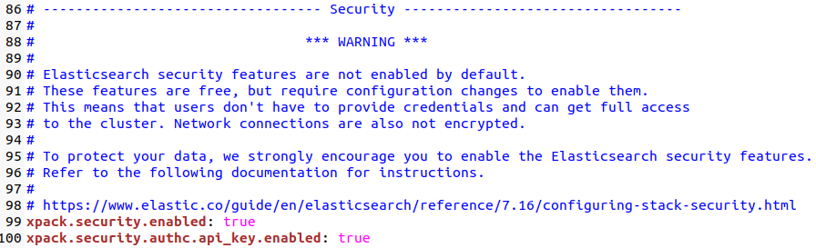

## Kibana

Câu lệnh cài đặt Kibana bằng hệ thống APT là:

sudo apt-get install kibana

Các tệp cấu hình của Kibana nằm trong thư mục /etc/kibana. Trong thư mục này, tệp cấu hình các chức năng chính của Kibana là kibana.yml.

Phần cấu hình đầu tiên là địa chỉ IP của Kibana để người dùng truy cập, được thể hiện ở hình dưới đây. Dòng cấu hình server.host: "0.0.0.0" chỉ định Kibana chỉ được truy cập từ chính máy đang cài đặt nó - máy ELK.

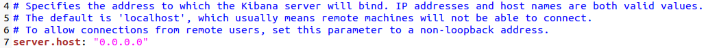

Phần cấu hình tiếp theo là URL trỏ đến Elasticsearch mà Kibana muốn truy cập để hiển thị dữ liệu, thể hiện ở hình dưới đây. Đó là địa chỉ IP và số hiệu cổng mặc định của Elasticsearch.

Phần cấu hình tiếp theo là tài khoản đăng nhập vào Elasticsearch. Trước khi thực hiện cấu hình này, tài khoản truy cập Elasticsearch cần được tạo mật khẩu mới với tên tài khoản mặc định là "elastic". Việc này được thực hiện bởi một shell script tạo mật khẩu Elasticsearch có tên elasticsearch-setup-passwords, nằm tại đường dẫn /usr/share/elasticsearch/bin. Câu lệnh chạy script này là:

./usr/share/elasticsearch/bin/elasticsearch-setup-passwords [auto/interactive]

Nếu muốn tạo một mật khẩu ngẫu nhiên thì chọn giá trị auto; ngược lại, nếu muốn chỉ định một mật khẩu thì chọn giá trị interactive và gõ mật khẩu đó theo hướng dẫn của script. Ở đây, mật khẩu là "123456". Sau khi tạo mật khẩu thành công, chúng ta có thể nhập tên đăng nhập và mật khẩu trên vào hai dòng cấu hình elasticsearch.username và elasticsearch.password như hình dưới đây.

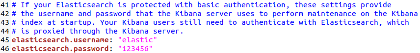

Phần cấu hình cuối cùng là tính năng Encrypted Saved Objects. Đây là tính năng bắt buộc phải được kích hoạt để mã hóa các dữ liệu nhạy cảm mà Kibana trao đổi với Elasticsearch như rule, API key. Dòng cấu hình sau kích hoạt chức năng này với một khoá ngẫu nhiên dài 32 ký tự (ở đây đang chọn giá trị khoá là A7kP2mX9qL4vN8cR1tY6uB3dF5gH0jWs):

xpack.encryptedSavedObjects.encryptionKey: A7kP2mX9qL4vN8cR1tY6uB3dF5gH0jWs

## Khởi chạy hệ thống

Trên máy Ubuntu và máy ELK, chúng ta khởi chạy Elasticsearch, Logstash, Kibana và Filebeat bằng câu lệnh sau:

sudo systemctl start [Tên dịch vụ]

Sau khi khởi chạy, chúng ta có thể kiểm tra trạng thái hoạt động hiện tại của từng dịch vụ bằng câu lệnh sau:

sudo systemctl status [Tên dịch vụ]

Trên máy Windows, chúng ta cài đặc dịch vụ Winlogbeat bằng PowerShell (điều hướng đến thư mục của Winlogbeat và chạy PowerShell bằng quyền Administrator) với câu lệnh:

./install-service-winlogbeat.ps1

Sau khi cài đặt dịch vụ, bằng Powershell trên, chúng ta tiếp tục chạy lệnh sau để khởi động Winlogbeat:

Start-Service winlogbeat

Để kiểm tra trạng thái của Winlogbeat, chúng ta chạy câu lệnh PowerShell sau:

Get-Service winlogbeat

## Tạo các rule

## Tạo dashboard

# Kết quả
